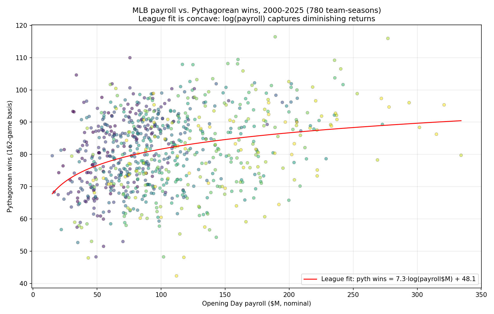
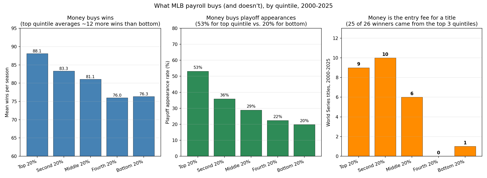
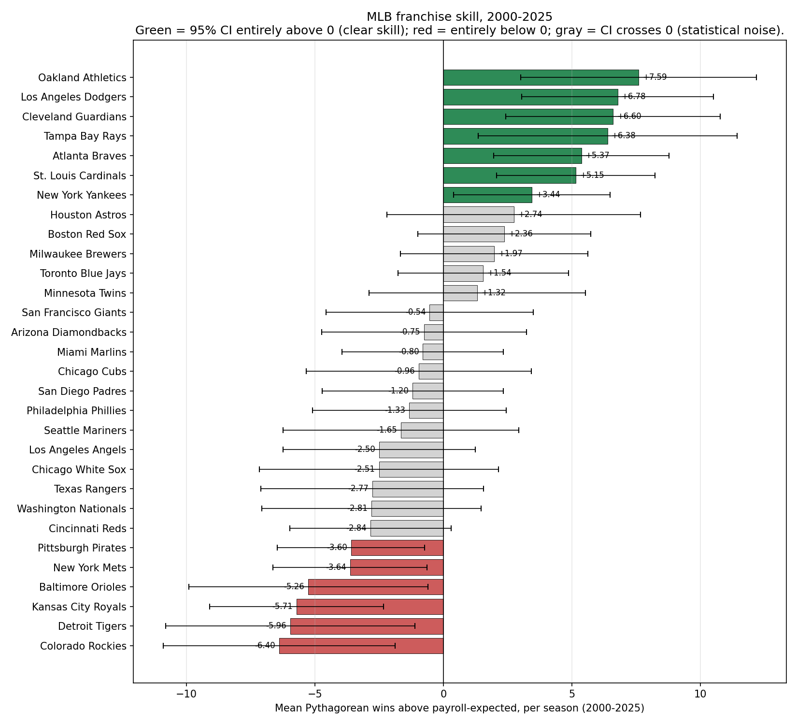
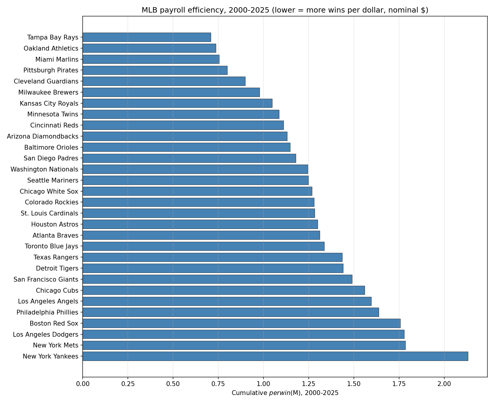
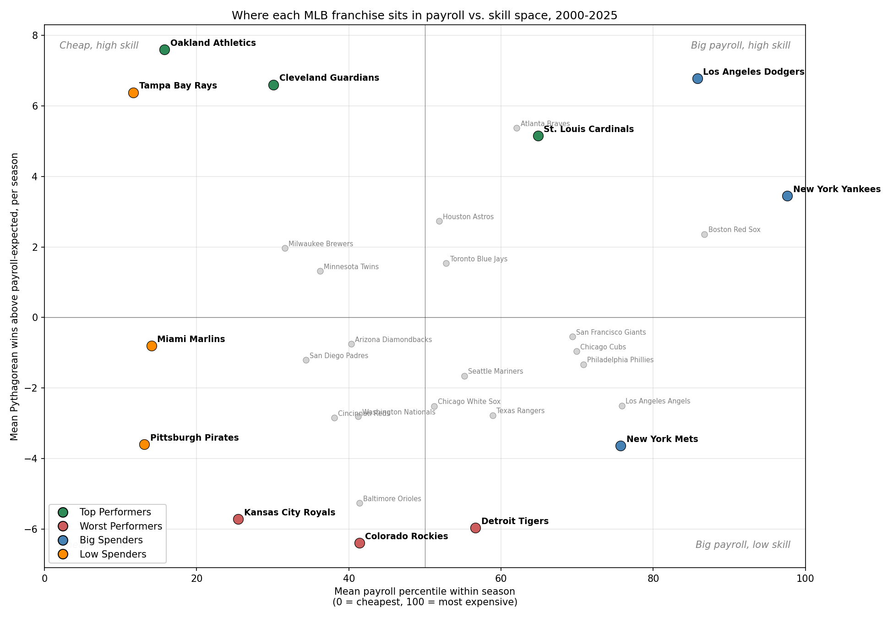
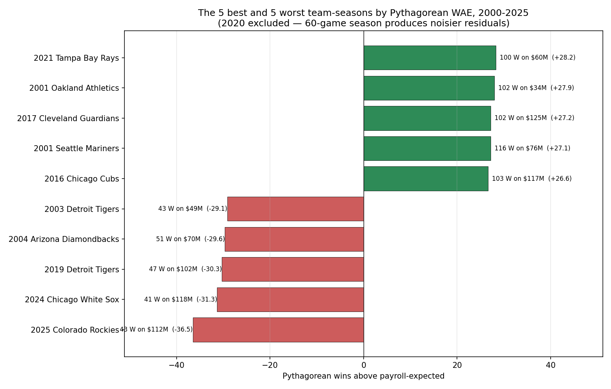

# Who Runs the Smartest Front Offices in Baseball?

### Ranking MLB Payroll Skill, 2000–2025

---

## 1. The Question

The New York Yankees have made the playoffs in 21 of 26 seasons since 2000 and won exactly one World Series. The Tampa Bay Rays have spent most of the same window with the league's lowest payroll and built two pennant winners. The Oakland Athletics turned "Moneyball" into a sustained operating philosophy that posts the best payroll-to-wins record of any organization this century. The Los Angeles Dodgers have spent like the Yankees and won three of the last six World Series.

Which of these franchises has the smartest front office? That's the question this report answers.

We measure front-office skill by how many wins each franchise produced above what its payroll predicted, year after year, for 26 seasons.

We're not asking who's smartest at developing pitchers or who scouts internationally best or who got lucky with a Hall of Fame draft pick. We're asking — given the dollars they spent — which franchises consistently won more games than the league's spending economics said they should.

---

## 2. Background

Before measuring anything, three pieces of context shape how to think about MLB front offices: **wins are noisier than they look**, **the payroll-wins relationship is loose and concave**, and **money buys some specific things and not others**.

### Wins Are Noisier Than They Look

A baseball season is 162 games, but most teams' actual win total contains 5–10 wins of pure noise — close-game variance, walk-off luck, sequencing of hits, and the bullpen having a bad week in August.

That estimate isn't a guess. Sabermetric research dating back to Bill James's earliest *Baseball Abstracts* has documented a striking pattern: **a team's record in one-run games — typically 40–50 per season, about a quarter of the schedule — has almost no year-over-year correlation.** A team that goes 30-15 in one-run games one year is roughly as likely to go 22-23 the next as to keep winning at that clip. The familiar "good teams win close games" narrative is mostly survivor bias; close-game performance is closer to a coin flip than a repeatable skill, and it's the largest single source of mismatch between a team's record and its actual underlying play.

Two other well-documented sources stack on top:

- **Bullpen sequencing.** A reliever in a 5-run game contributes a fraction of a win; the same reliever in a one-run game can decide it. Bullpen performance specifically in high-leverage spots is itself volatile year over year — a great reliever has the same ERA whether their team wins or loses the close ones, but the bullpen-W/L line moves dramatically based on luck of inning context.
- **Hit clustering.** The same number of hits in an inning produces wildly different run totals depending on whether they bunch up or spread out. Some teams string together a five-run inning out of three singles and a double; others get the exact same hits across nine innings and score one run. The "cluster luck" community at FanGraphs and Baseball Prospectus has shown this typically contributes another 2–4 wins of noise per season.

Add it all up and the standard deviation of a team's actual wins from its underlying run-differential performance lands around 4 wins per season, with roughly one team a year deviating by 10+ wins in either direction. Those outlier teams are the ones that get articles written about them — and they're the reason a wins-only ranking would mistake luck for skill.

#### Pythagorean Wins

The standard sabermetric correction is **Pythagorean wins**, a formula Bill James introduced in his *Baseball Abstract* series in the early 1980s. The name comes from the shape of the original equation — the squares looked like the Pythagorean theorem — but the idea is simple: a team's "true" winning percentage is determined by how many runs they score versus give up, not by how those runs are sequenced.

The original James formula uses a fixed exponent of 2:

$$W\% = \frac{RS^{2}}{RS^{2} + RA^{2}}$$

where:

- $W\%$ represents the expected win percentage of the team
- $RS$ represents the number of runs the team scored
- $RA$ represents teh number of runs the team allowed

The variant of Pythagorean wins that we use throughout this report is **pythagenpat**, developed by David Smyth in the early 2000s. It is now the standard at FanGraph and Baseball-Reference, and it's used for most modern sabermetric work. Instead of a fixed exponent, pythagenpat lets the exponent vary with run environment:

$$W\% = \frac{RS^{x}}{RS^{x} + RA^{x}}, \qquad x = \left(\frac{RS + RA}{G}\right)^{\!0.287}$$

where:

* $x$ is the run-environment-adjusted exponent
* $G$ represents games played

This allows the variable exponent to adapt to eras of baseball with different run-scoring norms. This makes the formula more accurate at extreme run environments. This is a necessary adaptation given the early 2000s steroid-era offense and post-2020 high-strikeout pitching eras.

#### Actual Wins vs. Pythagorean Wins

How big is the typical gap between actual wins and Pythagorean wins? In any given season, **most teams finish within 2–4 wins of their Pythagorean prediction**. Deviations of 6+ wins are unusual; deviations of 10+ are historic events worth talking about.

A few well-known historic deviations from the past 15 years:

| Team-season | Actual W | Pythagorean W | Difference |
|---|---:|---:|---:|
| 2012 Baltimore Orioles | 93 | 82 | **+11** (famous overperformance) |
| 2016 Texas Rangers | 95 | 82 | **+13** (the largest in recent memory) |
| 2023 San Diego Padres | 82 | 92 | **−10** (\$237M payroll, +104 run differential, missed the playoffs) |
| 2024 Chicago White Sox | 41 | 48 | **−7** (a record-loss team that was *also* close-game unlucky) |

When we measure front-office skill, we don't want a GM getting credit (or blame) for the luck and uncontrollable events that lead to these deviations. Pythagorean wins are the response variable throughout this report, because they are a better representation of what a front office can control.

### Relationship Between Payroll and Wins

The relationship between payroll and Pythagorean wins is central to this analysis – that will be further described in the methodology section below. 

For now, it is important to understand that a few things:

1. There are diminishing returns to each dollar spent on payroll. 
2. Payroll does not explain a high percentage of the variance in wins. 
3. Money gives front offices opportunities to compete.

The chart below plots all 780 team-seasons in our window:

Using the above chart, you can see:

- **Diminishing returns are real.** Going from **\$50M to \$100M** in payroll predicts about **+5 Pythagorean wins** at the league average. From \$100M to \$200M, another **+5**. From \$200M to \$300M, only about **+3** more. Each doubling of payroll buys roughly the same number of additional wins — the marginal dollar buys less the more you've already spent.
- **The fit is loose.** The average within-season R² is **0.154** — payroll explains only about 15% of the variance in Pythagorean wins. Eighty-five percent of what separates a 75-win team from a 95-win team is something other than money. That's where front-office skill lives.

It is worth diving deeper into how money gives front offices more opportunties to compete and win.

### What Money Buys

When looking into whether money can buy success, it is importan to define success.

We assume three definitions of success:

1. **Win:** Teams are trying to win games by scoring more runs than their opponents, summarized by Pythagorean wins
2. **Playoff Appearances:** There is material benefit to making the playoffs, including a chance for a title and additional revenue
3. **Titles:** The ultimate competitive goal of the sport

To examine how payroll correlates with the three above definitions of success, teams were organized quintiles for each season based on their payroll.

Below, we chart the relationship between each quintile and the measures of success.

Based on the chart above, we can make a few conclusions:

1. **Money can buy regular-season wins, but money isn't the only factor.** Top-quintile team-seasons average **88.1 wins**; bottom-quintile average **76.3**. That's a 12-win gap; but these are averages. There is variation within each quintile.
2. **Money can buy playoff appearances – but cheap teams can still get there.** Top-quintile teams reach the playoffs in **53%** of their team-seasons; the bottom quintile manages **20%**. The Rays, A's, and Guardians have spent most of the century in the bottom third of payrolls and combined for 30 playoff appearances anyway. Money is a tailwind for getting to October, not a gate.
3. **Money is the entry fee for a title.** Of the 26 World Series winners in our window, **25 came from the top three quintiles**. Only one team from the bottom 40% of payrolls — the 2003 Marlins, who promptly held the league's most famous fire sale — has won a ring since 2000. Bottom-40% teams have made 65 playoff appearances and won 1 World Series; top-60% teams have made 184 playoff appearances and won 25. Per appearance, that's 1.5% vs. 13.6% — payroll quintile changes the title conversion rate by a factor of **nine**.

The implication for what follows: a skilled front office can build a *contender* at any payroll (the Rays prove it). It cannot reliably build a *champion* at any payroll. The structural ceiling is real, and even the best front offices operate inside it. Front offices should not be penalized for their ownership not proving the funds necessary to compete for a title.

---

## 3. What We Measured

### The Methodology

The analysis starts by defining a skill metric on which to measure front office abaility. 

Our basic definiition of front office skill **how a team performs relative to how its payroll predicted it would perform.**

The metric representing this is described below.

#### Expected Wins from Payroll

First, we need to predict how many games a team should win based on its payroll. 

For each season $t$, we fit the following OLS regression across that year's 30 teams:

$$\widehat{W}^{\,\text{pyth}}_{\,162,\,i,t} = \alpha_{t} + \beta_{t} \cdot \ln\!\bigl(P_{i,t}\bigr)$$

where:

- $\widehat{W}^{\,\text{pyth}}_{\,162,\,i,t}$ is team $i$'s expected number of wins in season $t$ on a 162-game basis, using the pythagenpat methodology described above
- $\alpha_{t}$ is the season-$t$ intercept
- $\beta_{t}$ is the season-$t$ slope coefficient on log-payroll
- $P_{i,t}$ is team $i$'s Opening Day payroll in season $t$, in millions of dollars

Pythagorean wins as the response strips out the close-game luck described in Section 2. Log-transformed payroll captures the diminishing-returns concavity from the league-shape chart — fitting a straight line through that concave curve would systematically over-credit low-payroll teams and under-credit big spenders. 

Fitting one regression per year, rather than a single regression across the whole period, controls for inflation (both actual $ inflation and league payroll inflation) automatically: each season's slope is calibrated to that season's MLB payroll dollars.

We can use these resulting models to estimate how many games each team should have won in a given year given its payroll. Moving forward, we will refer to this is predicted wins.

#### Win Residuals

With predicted wins estimates computed and the actual wins (actual Pythagorean wins based on actual runs scored and actual runs allowed), we are now able to calculate the residuals for each team-season. This is how many more or less wins a team achieved than they were expected to based on their payroll. We call it **Wins Above Expected** (WAE):

$$\text{WAE}_{i,t} = W^{\,\text{pyth}}_{\,162,\,i,t} - \widehat{W}^{\,\text{pyth}}_{\,162,\,i,t}$$

where $W^{\,\text{pyth}}_{\,162,\,i,t}$ is team $i$'s actual Pythagorean wins (on a 162-game basis) in season $t$, and $\widehat{W}^{\,\text{pyth}}_{\,162,\,i,t}$ is the prediction from the per-season regression above.

#### Franchise Skill Metric

Averaging those residuals for franchise $i$ across all $T = 26$ seasons gives the **mean Pythagorean wins above payroll-expected** for that franchise:

$$\overline{\text{WAE}}_{i} = \frac{1}{T} \sum_{t=1}^{T} \text{WAE}_{i,t}$$

This is the front-office skill metric we will use moving forward.

### The Data

For every team-season from 2000 through 2025 we paired two inputs — payroll and on-field performance — and applied a few normalizations so the numbers from 2002 are comparable to the numbers from 2025.

- **Payroll: Opening Day, active 26-man roster commitments, nominal USD.** Compiled from a combination of [Spotrac](https://www.spotrac.com/mlb/payroll/), USA Today's MLB salaries database, and [The Baseball Cube](https://www.thebaseballcube.com/). For the 2020 COVID-shortened season we use *pre-pandemic* Opening Day commitments rather than the prorated cash that was actually paid, so 2020 stays on the same scale as the other 25 seasons.
- **Wins, runs scored, and runs allowed.** Pulled from the MLB Stats API (`statsapi.mlb.com`), which is the league's own JSON endpoint for standings. 2020 actual wins are prorated to a 162-game pace; Pythagorean winning percentages are computed from the actual 60-game runs-scored and runs-allowed, then projected to 162.
- **Franchise renames and relocations** (Montreal Expos → Washington Nationals, Tampa Bay Devil Rays → Tampa Bay Rays, Florida Marlins → Miami Marlins, Anaheim Angels → Los Angeles Angels, Cleveland Indians → Cleveland Guardians) are collapsed to a single canonical name per franchise so we can track each one's whole 26-year arc.

Total dataset: 780 team-seasons (30 teams × 26 years). All of the joining, regression, and chart code that produced this report lives in the same repository as the report itself.

---

## 4. The Best (and Worst) Front Offices

Here are all 30 franchises sorted by front-office skill, 2000–2025. The black bars are 95% confidence intervals on each franchise's mean.

> **How the confidence intervals were computed.** 
>   
>For each franchise $i$ we have $n = 26$ annual WAE residuals (one per season, 2000–2025). Let $\overline{\text{WAE}}_{i}$ be the franchise's mean residual and $s_{i}$ the sample standard deviation of those 26 residuals. The standard error of the mean is
> $$\text{SE}\!\left(\overline{\text{WAE}}_{i}\right) = \frac{s_{i}}{\sqrt{n}} = \frac{s_{i}}{\sqrt{26}}$$
> which typically lands between 1.5 and 2.5 wins per franchise, depending on how variable their year-to-year residuals are. The 95% confidence interval is then
> $$\overline{\text{WAE}}_{i} \pm 1.96 \cdot \text{SE}\!\left(\overline{\text{WAE}}_{i}\right)$$
> the range we'd expect to contain the franchise's "true" long-run skill if we could keep running 26-year windows. This treats each year's residual as an independent sample of the franchise's skill, which is a reasonable assumption here because the per-season regression is fit independently each year (so residuals don't share fitting noise across seasons).

The chart tells the story in three tiers, and the tiers come from the data, not our judgment:

- **Green bars (7 teams)** have 95% confidence intervals entirely above zero. These are the front offices whose skill premium is statistically clear.
- **Red bars (6 teams)** have intervals entirely below zero. These are the franchises whose underperformance is statistically clear.
- **Gray bars (17 teams)** have intervals that cross zero — they're in the statistical noise, which means we can't reliably distinguish them from "league average front office."

### The clearly-skilled tier

1. **Oakland Athletics** — **+7.6** mean WAE (95% CI: +3.0 to +12.2)
2. **Los Angeles Dodgers** — **+6.8** (+3.0 to +10.5)
3. **Cleveland Guardians** — **+6.6** (+2.4 to +10.8)
4. **Tampa Bay Rays** — **+6.4** (+1.3 to +11.4)
5. **Atlanta Braves** — **+5.4** (+2.0 to +8.8)
6. **St. Louis Cardinals** — **+5.2** (+2.1 to +8.2)
7. **New York Yankees** — **+3.4** (+0.4 to +6.5)

These seven are the answer to the headline question. The point estimates rank them 1 through 7, but the confidence intervals overlap heavily — A's through Cardinals are essentially statistically indistinguishable from each other. Calling A's "#1" and Cardinals "#6" overstates what the data can support. The honest reading: **these are the seven front offices whose payroll skill is statistically clear**, and the gap between any two of them inside that group is within the margin of error.

Two patterns stand out. Three of the seven (A's, Guardians, Rays) are bottom-third spenders running Moneyball-descended operations. Three more (Dodgers, Braves, Cardinals) are top-half spenders that *also* outperform what their money predicts — they're not buying their way in. And one franchise — the Dodgers — sits in a position no other large-payroll team reaches: spending like the Yankees, outperforming like the Athletics. That's the single most striking finding in the dataset: high payroll *and* high skill is possible, but only one franchise has actually pulled it off over the 26-year window.

### The clearly-unskilled tier

1. **Colorado Rockies** — **−6.4** mean WAE (CI: −10.9 to −1.9)
2. **Detroit Tigers** — **−6.0** (−10.8 to −1.1)
3. **Kansas City Royals** — **−5.7** (−9.1 to −2.3)
4. **Baltimore Orioles** — **−5.3** (−9.9 to −0.6)
5. **New York Mets** — **−3.6** (−6.6 to −0.6)
6. **Pittsburgh Pirates** — **−3.6** (−6.5 to −0.7)

Same caveat: these six are statistically indistinguishable from each other, but distinguishable as a group from "league average." Some are cheap and bad (Pirates, Royals), some are expensive and bad (Mets, Tigers, Orioles), and one (Rockies) has structural problems above any individual GM (Coors Field is a real confounder we can't strip out — more on that in the spotlights).

### The 17 in the middle

The other 17 franchises — Astros, Red Sox, Brewers, Blue Jays, Twins, Giants, Diamondbacks, Marlins, Cubs, Padres, Phillies, Mariners, Angels, White Sox, Rangers, Nationals, Reds — all have confidence intervals that cross zero. They've been good in some windows and bad in others, in roughly equal measure. The right read is "competently average over 26 years" — not because they don't try, but because 26 years of mixed results, given the noise level of MLB, isn't enough data to call them anything else.

> ### Methodology Note: Payroll/Win
> If you've ever seen this question analyzed before, it was probably by **cumulative dollars per win** — total payroll divided by total wins, lowest is best.
>   
> 
>   
> Same direction as the skill ranking, but very different teams at the top. The Pirates rank #4 by \$ per win and the Marlins rank #3 — both look like efficient operators. They're not. The problem with \$ per win is that it rewards being *cheap* almost as much as it rewards being *good*. A team that pays \$50M and wins 70 games has a \$ per win of \$714K; a team that pays \$250M and wins 95 games has a \$ per win of \$2.63M. The cheap team looks 3.7× more "efficient" — but the cheap team is losing 92 games. The ratio looks tidy because the denominator is small.
>   
> That's exactly what's happening at the top of the nominal ranking. The Pirates' 26-year average payroll is around \$58M and their average win total is 74. The Marlins' average is \$57M and 73 wins. Both teams sit in the top five by \$ per win because they keep paying for the league's worst rosters. **It's not skill — it's surrender.** Filtered through our per-season regression — Pythagorean wins on a concave log-payroll fit, so cheap teams aren't given an artificial boost — both teams land in the bottom or middle of the skill ranking. They got the wins their cheapness predicted, which is the definition of an unskilled front office.

---

## 5. Spotlights

The 13 franchises below cover the ends of the skill distribution and the most-watched teams in MLB. Each profile leads with three numbers: **mean WAE** (how many Pythagorean wins above payroll-expected per season), **payroll percentile** (where they typically sit in the league's spending order, 0 = cheapest, 100 = most expensive), and **playoff appearances / World Series titles** in the 26-year window.

### The clearly-skilled franchises

**Oakland Athletics — WAE: +7.6, payroll pct: 16, playoff trips: 11, titles: 0.**
The best front-office number in baseball, anchored by the lowest payroll position of any consistently-skilled team. The A's beat their predicted line by 7.6 Pythagorean wins per year on average and **+18.3 wins per playoff season** — sustained for 26 years. The 2001 team (102 wins on a \$34M payroll, +27.9 WAE) is the second-best single season in the dataset. The Moneyball operation produced contenders consistently — eleven Octobers — and zero rings. The franchise is the cleanest illustration of the structural ceiling from Section 2: skill at any payroll, championships only above the entry fee. The Sacramento relocation in 2025 closes the Oakland chapter.

**Los Angeles Dodgers — WAE: +6.8, payroll pct: 86, playoff trips: 17, titles: 3 (2020, 2024, 2025).**
The single most surprising entry on the list — and the only large-payroll franchise that *consistently* outperforms its own expensive line. Every other top-tier team beats the payroll line from a cheap base; the Dodgers do it from the 86th percentile, meaning they spend in the top quartile *and* still produce 6.8 Pythagorean wins above what that spending predicts. Their **+11.3 mean WAE in playoff seasons** is nearly double the all-season number — they don't just show up in October, they show up better than their roster predicts. Three titles in six years is what the only "paid-the-entry-fee + skill-premium" combination in the dataset produces.

**Cleveland Guardians — WAE: +6.6, payroll pct: 30, playoff trips: 10, titles: 0.**
The most sustained low-payroll success in the data — bottom-third spending almost every year, **+14.2 WAE per playoff season**, ten Octobers. The 2017 team (102 wins on a \$125M payroll, +27.2 WAE) is one of the five best single-season performances in the dataset. Notably, Cleveland is the *most* consistent franchise in the top tier — the smallest year-over-year swings, fewer down years than the A's or Rays. The structural ceiling has bitten them publicly twice: the 2016 World Series Game 7 loss and the 2024 ALCS exit. Same pattern as the A's: sustained contender, no champion.

**Tampa Bay Rays — WAE: +6.4, payroll pct: 12, playoff trips: 9, titles: 0.**
The most extreme version of the Moneyball arc. The Rays sit in the league's bottom 12th percentile of spending every year and still post +6.4 WAE — and **+19.6 WAE per playoff season, the highest playoff mark in baseball by a wide margin**. The 2021 team (+28.2 WAE) is the single best season in the dataset. They've produced two pennants (2008, 2020) and nine playoff appearances on payrolls typically one-fifth the Yankees'. Same structural ceiling caveat: zero World Series, despite winning two pennants. The Rays are the model the rest of the league has spent two decades trying to copy and the cleanest case of "skill is real but capped without spending."

**St. Louis Cardinals — WAE: +5.2, payroll pct: 65, playoff trips: 16, titles: 2 (2006, 2011).**
The quietest rebuttal to the "skill = small market" framing. The Cardinals spend at the 65th percentile — well above league median — and still produce real skill above what that spending predicts. Their hallmark is durability: their worst season in 26 years is only **−12.3 WAE**, by far the tightest worst-case bound in the top tier. They've made October sixteen times and won two rings in the window. The Cardinals prove that the skill premium isn't restricted to bargain-bin payrolls — and unlike the A's, Rays, and Guardians, they've also paid the entry fee often enough to win.

**Atlanta Braves — WAE: +5.4, payroll pct: 62, playoff trips: 16, titles: 1 (2021).**
Almost a structural twin of the Cardinals — same payroll tier, similar WAE, identical playoff count, one ring (2021). The recent run is built on locking in core players (Acuña, Albies, Riley, Olson) to long-term extensions before they hit free agency, which produces both above-line wins and a stable cost structure. Their 2023 team (+17.8 WAE) is one of the best single seasons in the data outside the top-tier dynastic peaks.

**New York Yankees — WAE: +3.4, payroll pct: 98, playoff trips: 21, titles: 2 (2000, 2009).**
The smallest WAE in the clearly-skilled tier — but earned on the league's highest payroll position essentially every year. The Yankees pay for a near-guaranteed playoff slot (21 of 26 seasons, the most in MLB) *and* produce a +3.4 win skill premium on top of that spending. Their **+6.1 WAE in playoff seasons** — nearly double the all-season average — shows they're not "just buying the floor." But the structural ceiling shows up clearly in their results: only two World Series in 26 years, and a long stretch of ALCS-or-earlier exits since 2009. Money buys consistency; only money plus October magic buys rings, and the Yankees rarely get the second.

### The clearly-unskilled franchises

**Colorado Rockies — WAE: −6.4, payroll pct: 41, playoff trips: 4, titles: 0.**
The worst franchise number in the data. The Rockies spend at the 41st payroll percentile — squarely mid-pack — and produce 6.4 fewer Pythagorean wins per season than that spending predicts. The 2025 team (43 wins on a \$112M payroll, **−36.5 WAE**) is the single worst season in the dataset. 21 of 26 seasons land below the league curve. Coors Field is a partial structural defense — the altitude genuinely warps pitcher development — but the consistency across three different GMs over 26 years suggests altitude alone doesn't account for the whole gap.

**Detroit Tigers — WAE: −6.0, payroll pct: 57, playoff trips: 7, titles: 0.**
The clearest "spent and lost" franchise. The Tigers' 57th-percentile payroll predicts an above-average team; they produce a six-Pythagorean-win-below-average team year after year. The 2019 collapse (−30.3 WAE on a \$102M payroll) is one of the five worst single seasons in the dataset. The franchise has cycled through cheap-and-bad, expensive-and-good (Cabrera/Verlander/Scherzer), expensive-and-collapsing (those same contracts aging into dead money), and back to cheap-and-bad — every failure mode the methodology can detect, in one franchise.

**Kansas City Royals — WAE: −5.7, payroll pct: 25, playoff trips: 3, titles: 1 (2015).**
A franchise whose entire 26-year story is one window. The 2013–2015 mini-dynasty produced two AL pennants and the 2015 World Series title — the only ring won at bottom-quartile payroll in our dataset, by any team. The rest of the period is long stretches of clearly-unskilled play. The −5.7 mean WAE shows what happens when even a cheap operation produces below-line baseball more often than not: low payrolls don't insulate against losing residuals; they just lose less expensively.

**Baltimore Orioles — WAE: −5.3, payroll pct: 41, playoff trips: 5, titles: 0.**
Most volatile franchise in the bottom tier. The 2018 collapse (47-115, \$143M payroll, **−27.9 WAE**) is one of the most expensive single-season failures in the data — exactly the kind of season that gets a GM fired. But the recent rebuild produced the 2023 AL East title and a **+19.8 WAE**, the highest single-season peak in any unskilled franchise's record. The current numbers reflect a 26-year average dragged down by the bad stretches; if the recent trajectory holds, Baltimore could exit the bottom tier within a decade.

**New York Mets — WAE: −3.6, payroll pct: 76, playoff trips: 6, titles: 0.**
The exact inverse of the Yankees and Dodgers. Top-quartile spending (76th percentile), below-average skill (−3.6 WAE). Zero World Series in the window, six playoff appearances, and three of the last four seasons featuring \$250M+ payrolls. The Mets are the clearest single piece of evidence in the data that money alone — without the skill premium the Dodgers and Yankees layer on top — does not buy proportional wins. Their 2003 team (−19.5 WAE on a \$117M payroll) ranks in the ten worst seasons in the dataset.

**Pittsburgh Pirates — WAE: −3.6, payroll pct: 13, playoff trips: 3, titles: 0.**
The poster franchise for "cheap is not the same as skilled" — and the most direct rebuttal to the nominal dollars-per-win ranking. The Pirates spend at the 13th payroll percentile, among the lowest in baseball, and *still* produce 3.6 fewer Pythagorean wins than even that minimal spending predicts. The 2013–2015 mini-window is their only sustained period above the line; the other 23 years are 90-loss seasons priced at \$58M. The Pirates rank #4 by nominal dollars per win because of the small denominator — but their skill ranking is honestly bad.

### Individual seasons worth noting

Single team-seasons aren't really front-office report cards — they're one year of roster execution. But the extremes are worth a glance: the 2021 Rays (+28.2 WAE), 2001 A's (+27.9), and 2017 Guardians (+27.2) are the three highest peaks in the data, all from clearly-skilled front offices. The 2025 Rockies (−36.5), 2024 White Sox (−31.3), and 2019 Tigers (−30.3) are the lowest troughs, two of three from clearly-unskilled front offices. The pattern is consistent: front-office quality compounds into the standout seasons too.

---

## 6. Caveats and Open Questions

A few honest limitations worth surfacing:

**The R² is what it is.** Payroll explains about 15% of within-season variance in Pythagorean wins. The residual we're measuring contains real front-office skill, but also some noise (injury luck, opponent quality, divisional strength, the bounces that Pythagorean wins don't capture). 26 seasons smooths most of it out — which is why we put statistical tiers on the rankings rather than treating ranks 1 through 30 as meaningful.

**Opening Day payroll misses mid-season activity.** A team that adds a \$30M deadline rental gets the wins from that player but not the cost in our measure. The Dodgers in particular spend aggressively at the deadline; a sensitivity analysis using end-of-season cash payroll or CBT (Competitive Balance Tax) payroll would shift their +6.8 WAE somewhat downward (and the Yankees' and the Mets' similarly). MLB itself uses CBT payroll as the unit that "counts" for spending purposes — switching to it would tell a marginally different story.

**Franchise ≠ GM, and that's a real limitation.** We've treated each franchise as one continuous front-office story over 26 years. That's a simplification with consequences. Some franchises have had one GM the whole period (the Yankees: Cashman, 1998+); others have had four (the Mets); a few have had clean before-and-after regimes that show up clearly in the per-season data (the Tigers went from "expensive-and-good" under one GM to "expensive-and-collapsing" under his successor; the Royals had one good window with their long-tenured GM that bookended two long bad ones). Aggregating those regimes into a single franchise number washes out real variation. **The natural follow-up to this report is to split franchise rankings by GM tenure** — that would tell us not just "which front offices are best" but "which specific people built them." The current ranking answers the franchise-level question; the GM-level question is open.

**The Rockies might be Coors Field, not bad GMs.** The 26 years of red on Colorado include three GMs all hitting the same wall. Either the franchise has been singularly unlucky in its hiring or the altitude is doing structural damage that no roster construction can overcome. The data can't separate those.

**The era boundary at 2011/2012 isn't statistically tested.** We note that the league's predictive power dropped meaningfully after the second wild card; a formal changepoint analysis would either validate it or find a different boundary.

---

## 7. The TL;DR

* **Seven franchises have demonstrably built above their payroll over 26 years:** Athletics, Dodgers, Guardians, Rays, Braves, Cardinals, Yankees. Their 95% confidence intervals are entirely above zero. They're statistically indistinguishable from each other inside that group.
* **The most surprising name in the top tier is the Dodgers** — the only franchise in the dataset that combines large-payroll spending with consistent above-curve overperformance. Three titles in six years (2020, 2024, 2025) is what that combination, sustained, produces.
* **Six franchises have demonstrably underperformed their payroll:** Rockies, Tigers, Royals, Orioles, Mets, Pirates. Some are cheap and bad, some are expensive and bad.
* **The other 17 franchises are in the noise** — competent or incompetent in different windows but not enough to distinguish from league average over 26 years.
* **Front-office skill operates inside a hard structural ceiling.** Money buys regular-season wins, playoff appearances, and — critically — the entry fee to actually win the World Series (25 of 26 titles came from the top three quintiles). The A's and Rays prove you can build a contender at any payroll. They don't show you can build a champion at any payroll.
* **The franchise unit hides real variation.** Some franchises had four GMs in 26 years; some had one. The natural follow-up is to redo this analysis by GM tenure to answer not just "which franchises are best" but "which specific people built them."

---

*Methodology and reproducible source: this report was generated from a Python pipeline that pulls regular-season standings (including runs scored and runs allowed) from the MLB Stats API, joins them with Opening Day payrolls compiled from Spotrac, USA Today, and The Baseball Cube, computes Pythagorean wins using the pythagenpat formula, and fits per-season OLS regressions of Pythagorean wins on log(payroll). All code, data, and supplementary charts live in this repository.*
